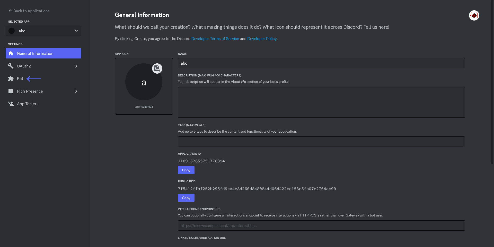
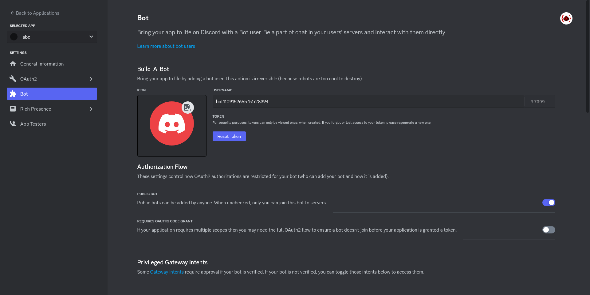
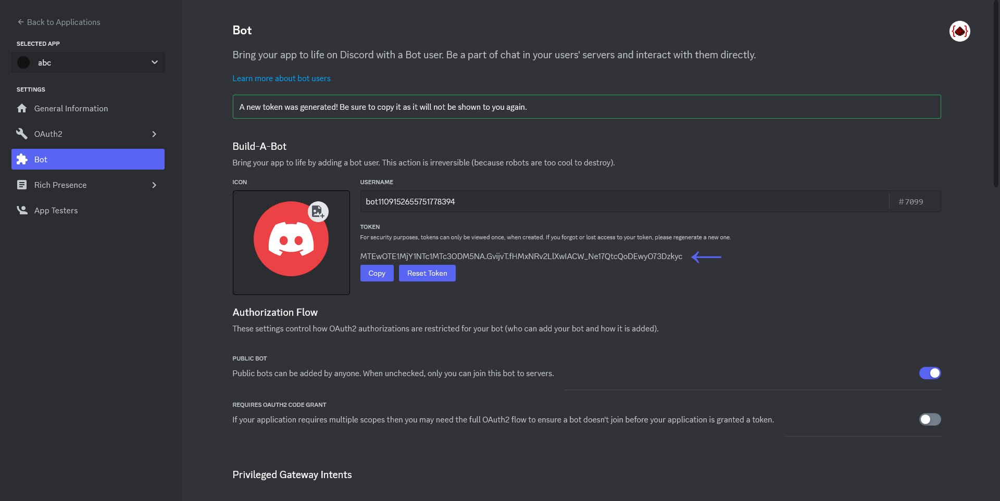
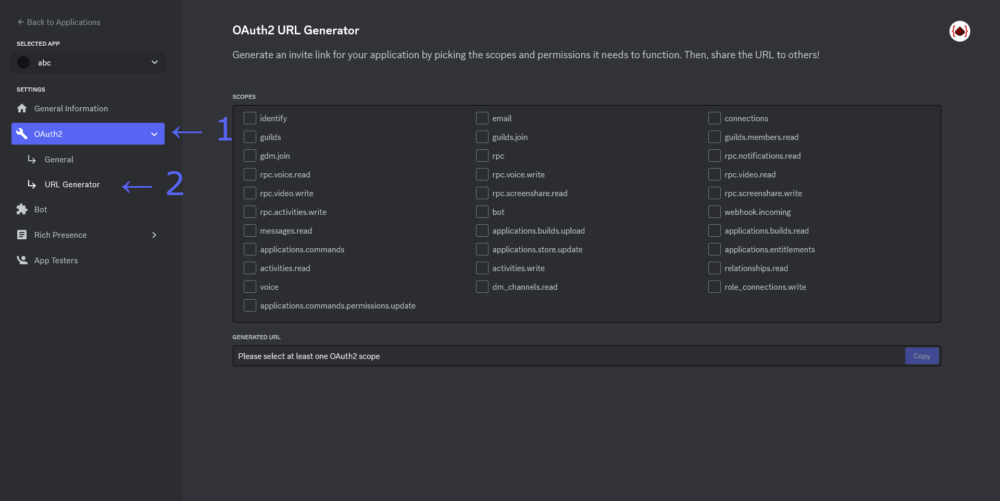
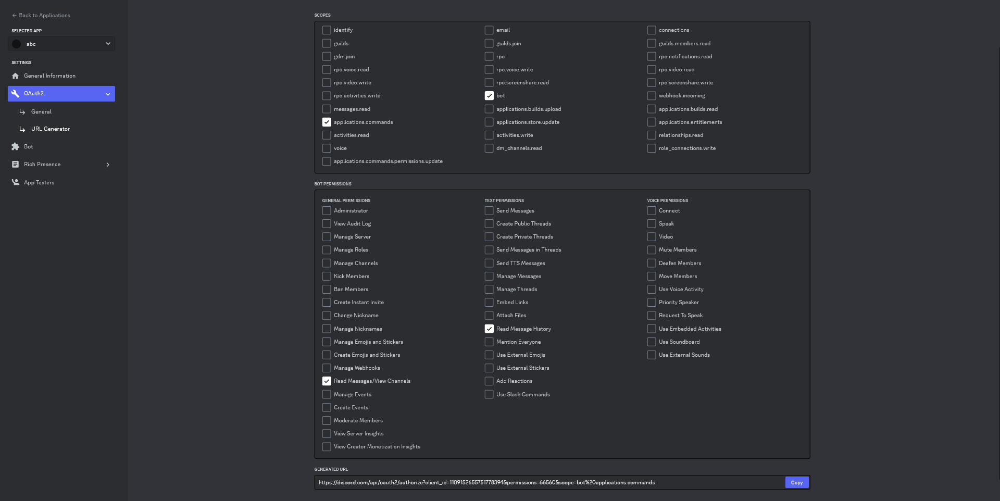

<div align="center">


# Dead Chat Tracker (DCT)
### A Discord bot made for only one purpose, and that is to track how long the channels of a server has died.
</div>

[](https://github.com/QuanMCPC/project.discord-dead-chat-bot.bot/blob/master/LICENSE)


**This is currently a Beta software. Expect to see lots of bugs**

## Features
 - Can track how long channels in a server have died
 - Fully Open Source and self-hostable
 - Very customizable
 - Only does one thing, and it does that one thing good
 - ~~Can bake a cake for you~~ the cake is a lie

## Requirements
 - NodeJS v18+ (other version not tested)
 - Git

## Installation (when you can't self-host a bot)
While I do provide an official Discord bot, I currently don't recommend using it since it's hosted on some free server that absolutely can't handle the load of a few hundred servers. Also, bug fixes will be rolled out quite frequently, so downtime (while being short) will be frequent.

Still, if that doesn't deter you from using the official bot, click the button below

**Alright, new update. You absolutely should just self-host it. Me trying to host it is just a mess.**

[](https://discord.com/oauth2/authorize?client_id=1107550968054292502&permissions=66560&scope=bot%20applications.commands)

## Installation (self-host)
### 1. Obtaining a Discord bot
 - Head on to the [Discord Developer Portal](https://discord.com/developers/applications)
 - Create a new application by pressing the "New Application" button on the top-right corner, then enter the name of the application (you can name the app anything you want, it doesn't have to be the name of this NodeJS program), accept their TOS or whatever that thing is, then click on "Create"
 
 - You should be on this page. Now, on this page, copy down the `APPLICATION ID`, this will be important later on, and then click on the `Bot` section on the left panel
 
 - Here, you can change the name of the bot (which you should do), and also the picture profile of the bot. And here's where you can obtain the Discord Token (ooh, sound scary) for the bot, which we'll need later on.
 
 - So on this page, click on the "Reset Token" button, confirm with Discord that you want to do it, and also enter your credential/2FA code to verify your identity. And then a token will be generated. **Make sure to write it down, and also to not share it publicly.**
 
 - Now that you've got those info write down, we'll need one final thing from this page, and that's the URL to invite the bot.
 - Head on to the `OAuth2` section on the left panel, and a drop down should appear. Click on `URL Generator`
 
 - Here, in the `SCOPES` box-thingy, tick the `bot` and `applications.commands`, and then in the `BOT PERMISSIONS` box-thingy, tick the `Read Messages/View Channels` and `Read Message History`.
 - After all of that, below should be the generated URL. Copy that, cause we'll use the URL to invite the bot
 

### 2. Get the bot up and runnin'
(To make sure you don't get confused, all commands will be shown by `$` at the front. Do not copy the dollar sign `$` when running the command)
 - Clone the repo by running:
 ```bash
$ git clone https://github.com/QuanMCPC/project.discord-dead-chat-bot.bot
 ```

 - Change directory to the bot's directory:
 ```bash
$ cd project.discord-dead-chat-bot.bot
 ```

 - Create a file named: `.env`, copy everything from the `.env.example` and pasted into the file.
 - Here, after the `TOKEN=` part, paste in the Discord bot token that you've obtained in step 3 in `Obtaining a Discord bot` section, and in the `APPLICATION_ID=` part, paste in the Application ID you've obtained in step 2 in `Obtaining a Discord bot` section.
 - The file should look something like this:
 ```env
TOKEN=MTEwOTE...
APPLICATION_ID=11091...
 ```

 - Next up, run the following command to install all the required dependencies:
 ```bash
$ npm install
 ```

 - Since this is written in TypeScript, you'll need to compile it first. Run the following command to compile:
 ```bash
$ npm run compile
 ```

 - Now, start the bot by running the following command:
 ```bash
$ npm run start
 ```

 - And hopefully, you should see this in the output somewhere:
 ```
[LOG] Ready!
 ```

### 3. Inviting the bot
Using the generated URL in step 6 in `Obtaining a Discord bot` section, paste it into a web browser, select the server which you want to add it to -> `Continue` -> `Authorize` -> CAPTCHA. And now, the bot should now be in your server of choosing

### 4. Start it
To start the bot, run `/enable`

## Upgrading
To upgrade the bot, run:
```
git pull
```
This will pull in the latest commit from the GitHub's repository. Now, if you haven't edit any file except the `.env` or the files in the `dist/` directory, then you shouldn't encounter any problem.

After upgrading, run:
```
npm run compile
```
to re-compile the TypeScript file again.

## Configuring
By using the `/config` command, you can get, set and get help about all the different configuration you can do with this bot. For more information about certain configuration or other thing, refer to the `Documentation` section in this README

## Documentation
### 1. Config
 - `message_to_print`: This will be the message printed to the chat when someone "revive" the chat. Now, since we want to also print info like how long was the chat died or who revived it, we can use **placeholders**, which when passed into the bot, will replace those with appropriate data. Here are those placeholders:
   - `<channel>`: The channel where the channel was dead and revived
   - `<time_in_seconds>`: The time in seconds which show how long have the channel been dead for
   - `<reviver>`: The user who has revived the chat.
   > Example: The channel `<channel>` has died for `<time_in_seconds>` seconds, and `<reviver>` has revived the chat.
### 2. Commands
 - The following commands are defaulted to requiring `Administrator` permissions on the server:
   - `/enable`
   - `/disable`
   - `/config`
 - The following commands are for everyone:
   - `/leaderboard`
   - `/about`

## License
Project's source code are licensed under the MIT license.